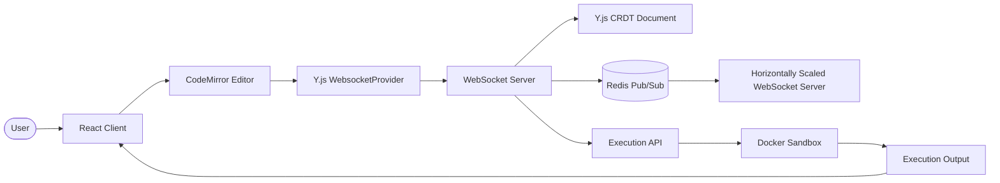
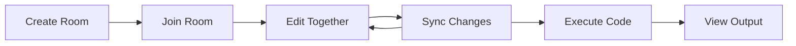
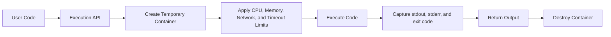

<div align="center">

# Real-Time Collaborative Code Editor

### A production-minded collaborative coding workspace powered by React, WebSockets, Y.js CRDTs, Redis Pub/Sub, and Docker-based sandbox execution.


[](https://react.dev/)
[](https://nodejs.org/)
[](https://developer.mozilla.org/en-US/docs/Web/API/WebSockets_API)
[](https://yjs.dev/)
[](https://redis.io/)
[](https://www.docker.com/)
[](./LICENSE)
[](#roadmap)

> Build together, sync instantly, and execute code safely in isolated infrastructure.

</div>

---

## Table of Contents

- [Project Overview](#project-overview)
- [Key Features](#key-features)
- [Screenshots](#screenshots)
- [Tech Stack](#tech-stack)
- [Architecture](#architecture)
- [Collaboration Workflow](#collaboration-workflow)
- [Docker Sandbox Architecture](#docker-sandbox-architecture)
- [Folder Structure](#folder-structure)
- [Installation Guide](#installation-guide)
- [Environment Variables](#environment-variables)
- [Running the Project](#running-the-project)
- [Testing](#testing)
- [Deployment Guide](#deployment-guide)
- [Security Features](#security-features)
- [Performance & Scalability](#performance--scalability)
- [Roadmap](#roadmap)
- [Learning Outcomes](#learning-outcomes)
- [Contributing](#contributing)
- [License](#license)

---

## Project Overview

**Real-Time Collaborative Code Editor** is a browser-based collaborative programming environment where multiple users can edit the same code document in real time. It combines a modern React frontend, CodeMirror editor experience, WebSocket transport, Y.js conflict-free replicated data types, Redis Pub/Sub coordination, and a Docker sandbox execution model for secure code running.

The project is designed to demonstrate the architecture behind real collaborative developer tools such as pair-programming platforms, coding interview environments, classroom coding labs, and multiplayer IDE experiences.

### What It Does

- Provides a shared code editor that syncs changes across connected users.
- Uses Y.js CRDT synchronization to avoid edit conflicts during concurrent typing.
- Supports WebSocket-based low-latency communication between the client and server.
- Publishes collaboration update metadata through Redis Pub/Sub for scale-out readiness.
- Defines a secure Docker sandbox execution architecture for running user code in temporary isolated containers.

### Real-World Use Cases

| Use Case | Description |
| --- | --- |
| Technical interviews | Let candidates and interviewers code in the same room with instant synchronization. |
| Pair programming | Enable two or more developers to collaborate remotely on shared snippets. |
| Coding classrooms | Allow instructors and students to work together in live programming sessions. |
| Hackathons | Give teams a lightweight browser-based collaborative editor. |
| Internal tooling | Build controlled execution environments for running snippets safely. |

### Why It Was Built

This project was built to explore the engineering challenges behind collaborative development platforms: distributed document synchronization, CRDTs, WebSocket lifecycle management, Redis-backed scaling, and secure execution boundaries for untrusted user code.

> [!NOTE]
> The current repository includes the collaborative editor, Y.js WebSocket synchronization, Redis connectivity, and Redis Docker Compose setup. The README also documents the intended production sandbox architecture for Docker-based secure execution.

---

## Key Features

| Feature | Status | Details |
| --- | --- | --- |
| Real-time collaborative editing | Implemented | Multiple clients can connect to the same Y.js room and edit shared CodeMirror content. |
| Room creation and joining | Implemented | Rooms are mapped through the Y.js WebSocket room name, with `default-room` available out of the box. |
| Y.js CRDT synchronization | Implemented | Conflict-free collaborative state is handled with `Y.Doc`, `Y.Text`, and `y-codemirror.next`. |
| Live presence tracking | Supported by architecture | Uses Y.js awareness via `provider.awareness` for cursor and user-state collaboration capabilities. |
| Join/Leave notifications | Supported by architecture | Can be layered on top of WebSocket connection and awareness lifecycle events. |
| Redis Pub/Sub scaling | Implemented foundation | Server publishes update metadata to a Redis channel named `collab-updates`. |
| Docker-based secure code execution | Designed | Sandbox flow is documented for isolated, temporary execution containers. |
| Resource-limited sandboxing | Designed | CPU, memory, timeout, and network controls are part of the production execution model. |
| Multi-user collaboration | Implemented | Y.js and WebSocket rooms allow multiple users to collaborate in the same editor session. |

---

## Screenshots

Add your production screenshots to the `assets/` directory and update the image paths below.

| Lobby Page | Collaborative Editor |
| --- | --- |
|  |  |

| Active Users Sidebar | Code Execution Output |
| --- | --- |
|  |  |

| Deployment Architecture |
| --- |
|  |

---

## Tech Stack

| Layer | Technology | Purpose |
| --- | --- | --- |
| Frontend | React 19, Vite, CodeMirror 6 | Fast client UI and browser-based code editing. |
| Backend | Node.js, Express 5, `ws` | HTTP health checks and WebSocket upgrade handling. |
| Realtime Layer | Y.js, `y-websocket`, `@y/websocket-server`, `y-codemirror.next` | CRDT-based document synchronization and editor binding. |
| Database/Cache | Redis 7 Alpine, ioredis | Pub/Sub messaging foundation for multi-instance scaling. |
| DevOps | Docker Compose, environment-based config | Local infrastructure orchestration and repeatable setup. |
| Deployment | VPS, PM2, Docker, reverse proxy | Production process management and service hosting. |

---

## Architecture

The application uses a client-server realtime model. React renders the CodeMirror editor, Y.js manages collaborative document state, WebSockets carry synchronization updates, Redis enables distributed message fan-out, and Docker provides an isolated execution boundary for user-submitted code.



### Request and Sync Flow

1. A user opens the React client and joins a room.
2. The editor creates a `Y.Doc` and binds it to CodeMirror through `y-codemirror.next`.
3. `WebsocketProvider` connects to the Node.js WebSocket server.
4. `@y/websocket-server` manages room-level Y.js document synchronization.
5. Redis receives collaboration update metadata through Pub/Sub for scale-out observability and coordination.
6. Code execution requests are routed to the sandbox layer and return output to the client.

---

## Collaboration Workflow



### How Collaboration Works

| Step | Description |
| --- | --- |
| Create Room | A room is identified by a shared Y.js room name. |
| Join Room | Users connect through the WebSocket provider using the same room name. |
| Edit Together | CodeMirror changes are bound to a shared `Y.Text` document. |
| Sync Changes | Y.js CRDT updates are distributed over WebSockets without manual conflict resolution. |
| Execute Code | The production flow sends code to an API that runs it inside an isolated Docker container. |

---

## Docker Sandbox Architecture

The sandbox architecture is designed for safe execution of untrusted user code. Each run creates a short-lived container with strict resource limits, captures the result, and destroys the container immediately after execution.



### Sandbox Guarantees

| Control | Purpose |
| --- | --- |
| Temporary containers | Each execution starts from a clean runtime and is destroyed after completion. |
| Non-root execution | Code runs without root privileges inside the sandbox. |
| CPU limits | Prevents infinite loops from monopolizing host CPU. |
| Memory limits | Stops memory-heavy programs from exhausting host resources. |
| Network isolation | Blocks unauthorized outbound network access from user code. |
| Execution timeout | Kills long-running processes automatically. |

---

## Folder Structure

```text
collab-code-editor/
??? client/
?   ??? src/
?   ?   ??? components/
?   ?   ?   ??? Editor.jsx
?   ?   ?   ??? WsTest.jsx
?   ?   ??? App.jsx
?   ?   ??? App.css
?   ??? package.json
?   ??? vite.config.js
??? server/
?   ??? index.js
?   ??? redis.js
?   ??? .env.example
?   ??? package.json
??? docker/
??? docker-compose.yml
??? README.md
```

---

## Installation Guide

### Prerequisites

- Node.js 20+
- npm
- Docker and Docker Compose
- Redis, either local or through Docker Compose

### 1. Clone the Repository

```bash
git clone https://github.com/your-username/collab-code-editor.git
cd collab-code-editor
```

### 2. Install Frontend Dependencies

```bash
cd client
npm install
```

### 3. Install Backend Dependencies

```bash
cd ../server
npm install
```

### 4. Configure Environment Variables

```bash
cp .env.example .env
```

Update values as needed:

```env
PORT=4000
NODE_ENV=development
REDIS_URL=redis://localhost:6379
VITE_WS_URL=ws://localhost:4000
VITE_API_URL=http://localhost:4000
```

### 5. Start Redis

From the project root:

```bash
docker compose up -d redis
```

### 6. Run the Backend

```bash
cd server
npm run dev
```

### 7. Run the Frontend

Open a second terminal:

```bash
cd client
npm run dev
```

The React app will be available at the Vite development URL, typically `http://localhost:5173`.

---

## Environment Variables

| Variable | Example | Description |
| --- | --- | --- |
| `PORT` | `4000` | HTTP and WebSocket server port. |
| `REDIS_URL` | `redis://localhost:6379` | Redis connection string used by `ioredis`. |
| `NODE_ENV` | `development` | Runtime environment. |
| `VITE_WS_URL` | `ws://localhost:4000` | WebSocket endpoint consumed by the React client. |
| `VITE_API_URL` | `http://localhost:4000` | API endpoint for health checks and execution requests. |

```env
PORT=4000
REDIS_URL=redis://localhost:6379
NODE_ENV=development
VITE_WS_URL=ws://localhost:4000
VITE_API_URL=http://localhost:4000
```

> [!TIP]
> Vite exposes only environment variables prefixed with `VITE_` to the browser client.

---

## Running the Project

### Frontend

```bash
cd client
npm run dev
```

### Backend

```bash
cd server
npm run dev
```

For production mode:

```bash
cd server
npm start
```

### Redis

```bash
docker compose up -d redis
```

Verify Redis is running:

```bash
docker compose ps
```

### Docker Sandbox

Production execution should run user code in short-lived containers with explicit limits:

```bash
docker run --rm \
  --network none \
  --cpus="0.5" \
  --memory="128m" \
  --pids-limit=64 \
  --read-only \
  node:20-alpine \
  node -e "console.log('Hello from sandbox')"
```

---

## Testing

Use the following checklist to validate the application before deploying.

### Collaboration Testing

- Open the frontend in two browser windows.
- Connect both clients to the same room.
- Type in one editor and verify the second editor updates instantly.
- Confirm concurrent edits merge without overwriting each other.

### Room Testing

- Join the same room from multiple clients and verify shared state.
- Join different room names and confirm document isolation.
- Refresh a client and verify it reconnects cleanly.

### Redis Testing

- Start Redis with `docker compose up -d redis`.
- Run the backend and confirm publisher/subscriber connection logs.
- Edit the document and verify update metadata is published to `collab-updates`.

### Sandbox Testing

- Execute valid code and confirm stdout is returned.
- Execute code with syntax errors and confirm stderr is captured.
- Run an infinite loop and confirm timeout enforcement.
- Run memory-heavy code and confirm memory limit enforcement.

### Deployment Testing

- Build the frontend with `npm run build`.
- Start the backend with `npm start` or PM2.
- Verify `/health` returns `{ "status": "ok" }`.
- Confirm WebSocket upgrades work behind the reverse proxy.

---

## Deployment Guide

### Docker Compose

Use Docker Compose for infrastructure services such as Redis:

```bash
docker compose up -d redis
```

For a full production deployment, add services for the frontend, backend, reverse proxy, and sandbox runner.

### PM2

Run the Node.js WebSocket backend with PM2:

```bash
cd server
npm install --production
pm2 start index.js --name collab-code-editor-api
pm2 save
```

### VPS Deployment

1. Provision a VPS with Docker, Node.js, npm, and Nginx or Caddy.
2. Clone the repository and install dependencies.
3. Configure `.env` values for production.
4. Start Redis through Docker Compose.
5. Build the frontend with `npm run build`.
6. Serve the frontend through a reverse proxy.
7. Run the backend with PM2.
8. Configure proxy WebSocket upgrade headers.

### Production Environment Variables

```env
PORT=4000
NODE_ENV=production
REDIS_URL=redis://localhost:6379
VITE_WS_URL=wss://your-domain.com
VITE_API_URL=https://your-domain.com
```

> [!IMPORTANT]
> In production, always serve WebSockets over `wss://`, terminate TLS at the reverse proxy, and keep sandbox execution isolated from the public network.

---

## Security Features

| Security Feature | Benefit |
| --- | --- |
| Non-root containers | Reduces privilege escalation risk inside execution sandboxes. |
| Network isolation | Prevents user-submitted code from reaching internal services or the public internet. |
| CPU limits | Protects host machines from CPU exhaustion. |
| Memory limits | Prevents runaway processes from consuming system memory. |
| Execution timeout | Automatically terminates long-running or malicious code. |
| Temporary containers | Ensures every execution starts clean and leaves no persistent state. |
| Read-only filesystem | Limits the ability of executed code to mutate container files. |
| Process limits | Restricts fork bombs and excessive process creation. |

---

## Performance & Scalability

### Y.js CRDT Architecture

Y.js enables local-first editing where each client can apply changes immediately and merge remote updates deterministically. This avoids centralized lock management and makes collaborative typing feel instant.

### Redis Pub/Sub Scaling

Redis Pub/Sub provides a foundation for broadcasting collaboration metadata across multiple backend instances. As the backend scales horizontally, Redis can coordinate room-level events and keep instances aware of distributed activity.

### Horizontal Scaling Support

The architecture supports multiple WebSocket server instances behind a load balancer when paired with shared Redis messaging and sticky sessions or room-aware routing.

### Efficient Synchronization

Y.js transmits compact binary updates instead of entire documents, reducing bandwidth usage and improving responsiveness for multi-user sessions.

---

## Roadmap

- [x] Real-time collaboration
- [x] Room management
- [x] Presence awareness
- [x] Redis scaling foundation
- [x] Docker sandbox architecture
- [ ] Authentication
- [ ] Multi-language execution
- [ ] AI assistant
- [ ] Persistent room history
- [ ] Role-based permissions
- [ ] Shareable room links

---

## Learning Outcomes

This project demonstrates hands-on implementation of modern realtime and distributed-system concepts:

- Building React applications with Vite and component-based UI architecture.
- Embedding CodeMirror 6 as a programmable code editor.
- Synchronizing shared text documents with Y.js CRDTs.
- Binding Y.js collaborative state to editor state with `y-codemirror.next`.
- Managing WebSocket connections in a Node.js server.
- Using `@y/websocket-server` to handle collaborative document rooms.
- Integrating Redis Pub/Sub with `ioredis` for scale-out messaging.
- Designing secure Docker execution boundaries for untrusted code.
- Planning production deployment with PM2, Docker Compose, and reverse proxies.

---

## Contributing

Contributions are welcome. If you want to improve collaboration features, add authentication, expand sandbox language support, or polish the editor UI, follow this workflow:

1. Fork the repository.
2. Create a feature branch.

   ```bash
   git checkout -b feature/your-feature-name
   ```

3. Commit your changes.

   ```bash
   git commit -m "Add your feature"
   ```

4. Push to your branch.

   ```bash
   git push origin feature/your-feature-name
   ```

5. Open a pull request with a clear description and testing notes.

### Contribution Ideas

| Area | Ideas |
| --- | --- |
| Collaboration | User cursors, user colors, join/leave toast notifications, room list UI. |
| Execution | Multi-language runners, test-case runner, execution history. |
| Security | Rate limiting, sandbox audit logs, stricter seccomp profiles. |
| Product | Authentication, room sharing, saved projects, dark theme. |

---

## License

This project is licensed under the **ISC License**.

You are free to use, modify, and distribute this project according to the license terms.

---

<div align="center">

### If this project helped you learn realtime collaboration, consider starring the repository.

Built with React, Node.js, WebSockets, Y.js, Redis, and Docker.

</div>
